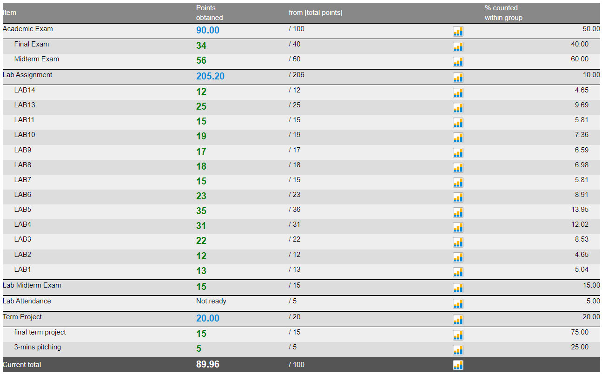

# PIRATE-SHIP

**This Repository serves as a distribution platform of my university assignments.**
It is meant to be used as an insight when you're feeling lost or when you simply
want to explore other solutions that your colleague came up with.
**NOT TO BE USED AS A MATERIAL IN DIRECT COPYING AND PASTING.**
Doing so will spoil the problems and ruin the fun,
as I regard programming to be one of the most pleasurable activities of humankind.
But ultimately the decision is yours, make the best out of it.

## 2301173-Programming

An Introductory Course to Programming taught in **Python**.
Since most of us used Jupyter Notebook to complete the assignments, including me.
I've went ahead and converted all .ipynb files to .py ones, for browsing convenience.

## 2301260-Programming-Techniques

An Introductory Course to Object-Oriented Programming taught in **Java**.
Since most of us used IntelliJ IDEA to complete the assignments, including me.
I've only included the files ending in .java, for browsing convenience.
